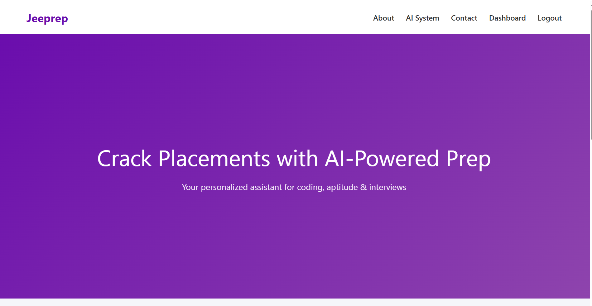
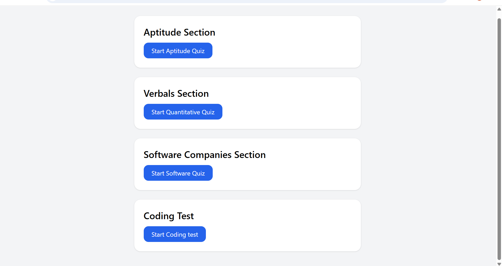
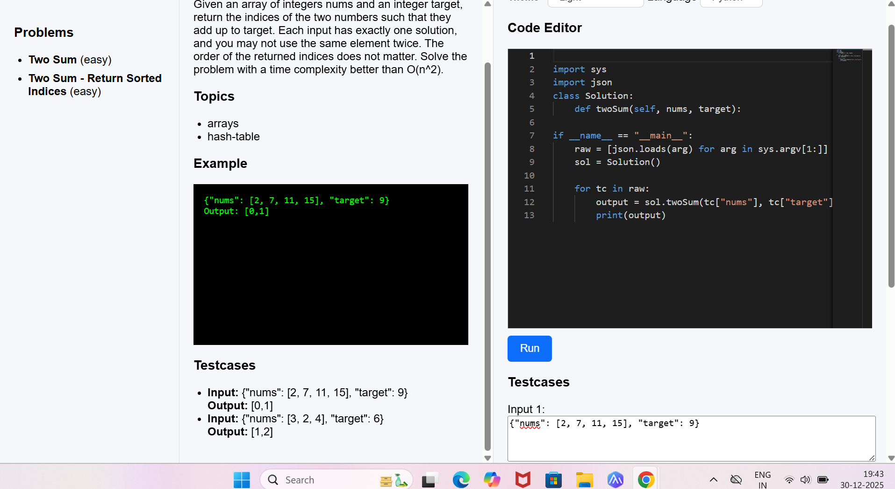

# JEEPREP – AI Placement Preparation Platform

JEEPREP is a Django-based web application designed to help students prepare for placements using AI-driven tools, structured content, and a clean web interface.
Practice makes you perfect. Lets help you with AI


### Project Structure


```text
.JEEPREP/
├── env/                    # Python virtual environment
│
├── jeeprep/                # Main project folder
│   ├── apti/               # Aptitude module / core business logic
│   ├── jeeprep/            # Django project settings and configuration
│
├── .env                    # Environment variables
├── bashscript.sh           # Helper script (setup / run tasks)
├── db.sqlite3              # SQLite database (default)
├── manage.py               # Django management script
├── .gitignore              # Git ignored files
└── README.md               # Project documentation
```










### Tech Stack

| Layer          | Technology                                   |
| -------------- | -------------------------------------------- |
| Backend        | Django (Python)                              |
| Frontend       | HTML, Tailwind CSS                           |
| Database       | SQLite (default, for development)            |
| Authentication | Django built-in Authentication (Auth tables) |


# Setup Instructions


Clone the Repository


```text
git clone https://github.com/your-username/jeeprep.git
cd jeeprep


Activate Virtual Environment


# Linux / macOS
source env/bin/activate

# Windows
env\Scripts\activate

```

# 


